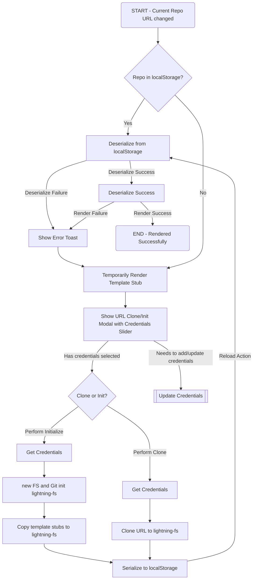

### User Stories
---
#### Clone Existing Project
- In order to modify or view an existing project
- As a user
- I want to be able to clone a repository

#### Create a New Project
- In order to use GitFeatures for a new project
- As a user
- I want to be able to create a new project
---
### Flow Diagram

