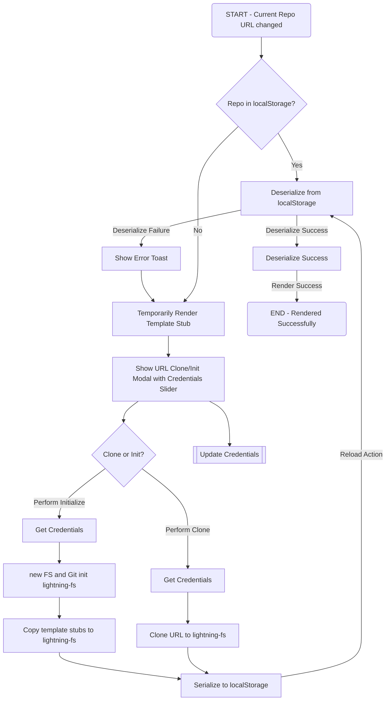

### User Story

- In order to modify or view an existing project
- As a user
- I want to be able to clone a repository
---

### Flow Diagram

```mermaid
graph TD
    A(START - Current Repo URL changed) --> B{Repo in localStorage?}
    B -->|Yes| deserialize[Deserialize from localStorage]
    deserialize -->|Deserialize Success| deserializeSuccess[Deserialize Success]
    deserialize -->|Deserialize Failure| errorToast[Show Error Toast]
    errorToast --> temporarilyRenderStub
    deserializeSuccess -->|Render Success| renderSuccess(END - Rendered Successfully)
    B -->|No| temporarilyRenderStub[Temporarily Render Template Stub]
    temporarilyRenderStub --> E[Show Init/Clone Modal]
    E[Show URL Clone/Init Modal with Credentials Slider] --> F{Clone or Init?}
    E --> updateCredentials[[Update Credentials]]
    F -->|Perform Clone| G[Get Credentials]
    F -->|Perform Initialize| H[Get Credentials]
    H --> git-init[new FS and Git init lightning-fs]
    git-init --> copy-stub[Copy template stubs to lightning-fs]
    copy-stub --> serialize[Serialize to localStorage]
    G --> I[Clone URL to lightning-fs]
    I --> serialize
    serialize --> |Reload Action| deserialize
```

